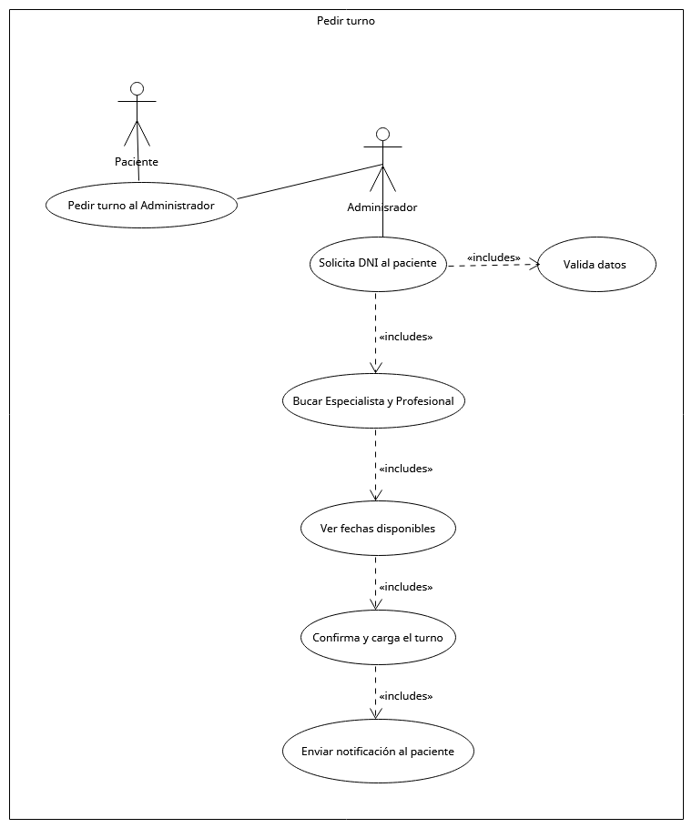
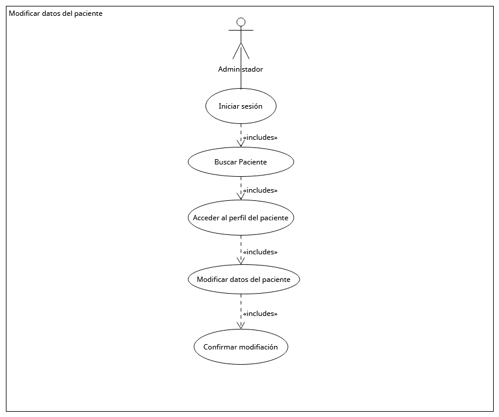
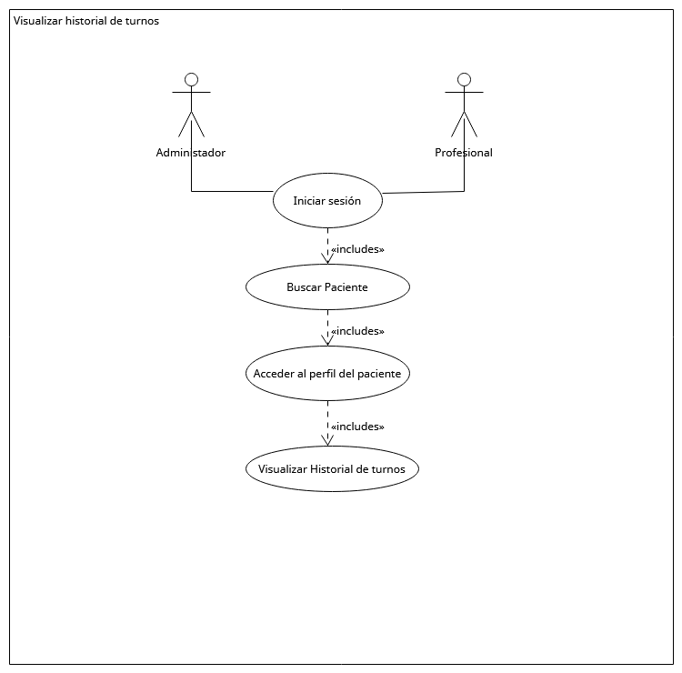

# Diagramas de Casos de Uso

---

## Caso de Uso 1: Pedir Turno

---

## Caso de Uso 2: Gestionar Turno

---

## Caso de Uso 3: Notificación de turno

---

## Caso de Uso 4: Modificar datos del paciente

---

## Caso de Uso 5: Visualizar historial de turnos

