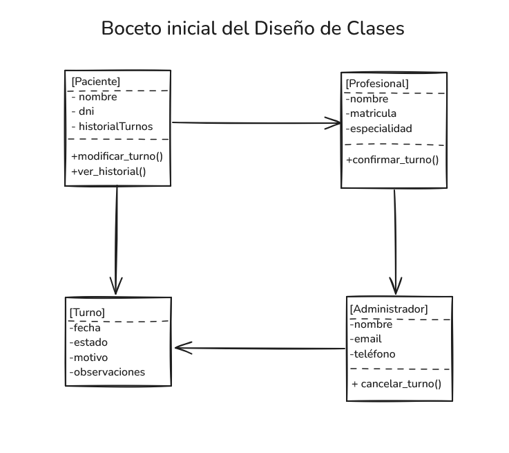

# Introducción al Diseño Orientado a Objetos

##  ¿Qué es la Programación Orientada a Objetos?

La **Programación Orientada a Objetos (POO)** es un paradigma que organiza el código en **clases** y **objetos**, buscando representar conceptos del mundo real dentro del software.

Este enfoque se basa en modelar entidades como objetos con **atributos** (datos) y **métodos** (acciones). De esta manera, el código resulta más intuitivo, reutilizable, escalable y fácil de mantener.

###  ¿Por qué es importante?

Porque permite construir sistemas complejos con estructuras claras, separando responsabilidades y reduciendo el riesgo de errores. Además, **facilita el trabajo en equipo** y el crecimiento progresivo del software.

Ejemplo: En lugar de tener una lista suelta con nombres de pacientes, podemos tener una **clase `Paciente`** con sus datos, métodos para modificar turnos, ver historial, etc. Mucho más organizado.

---

## Los Cuatro Fundamentos de la Programación Orientada a Objetos

A continuación se detallan los pilares fundamentales del paradigma POO.

### 1. Encapsulamiento 

Permite ocultar los detalles internos de un objeto, exponiendo solo lo necesario para su uso externo. Así, se protege la integridad de los datos y se reduce la complejidad.

**Ejemplo real:**  
Un control remoto: vos solo apretás los botones (subir volumen, cambiar canal), pero no necesitás saber qué circuitos se activan por dentro.

### 2. Abstracción 

Consiste en modelar las características esenciales de un objeto, ignorando los detalles irrelevantes. Nos permite centrarnos en lo importante para el problema que resolvemos.

**Ejemplo real:**  
Al pedir una pizza, solo te interesa elegir el sabor, tamaño y pagar. No necesitás saber el paso a paso de cómo la hacen en la cocina.

### 3. Herencia 

Permite que una clase (hija) herede atributos y métodos de otra clase (padre), facilitando la reutilización del código.

**Ejemplo real:**  
Una clase `Persona` tiene nombre, DNI y fecha de nacimiento. Una clase `Médico` puede heredar de `Persona` y además tener matrícula y especialidad.

### 4. Polimorfismo

Significa que diferentes clases pueden compartir el mismo método, pero implementarlo de formas distintas.

**Ejemplo real:**  
El método `mostrarDatos()` puede existir tanto en `Paciente` como en `Médico`, pero cada uno mostrará información diferente según lo que sea relevante.

---

## Requisitos Funcionales del Sistema

A continuación, se detallan cinco funcionalidades clave que el sistema deberá cumplir para solucionar los problemas actuales del centro de salud.

### 1. Registro y Gestión de Turnos

El sistema debe permitir registrar nuevos turnos, modificarlos o cancelarlos. Cada turno debe tener fecha, hora, estado (pendiente, confirmado o cancelado), paciente, médico, motivo y observaciones.

### 2. Validación de Disponibilidad

Al asignar un turno, el sistema debe validar que el médico no tenga otro turno en ese mismo horario, y que esté dentro de su horario de atención.

### 3. Gestión de Pacientes y Profesionales

Se debe poder registrar pacientes (con sus datos personales y contacto) y profesionales (con matrícula, especialidad, horarios, etc.), y editarlos si es necesario.

### 4. Notificaciones Automáticas

El sistema debe enviar notificaciones a pacientes y médicos cuando un turno sea confirmado, modificado o cancelado. Idealmente por correo electrónico o mensaje.

### 5. Historial de Turnos

Cada paciente debe tener un historial de todos los turnos tomados, incluyendo sus fechas, estados y médicos asignados.

---

##  Casos de Uso

###  Caso de Uso 1: Registrar un Turno

- **Actor(es):** Paciente, Administrador
- **Descripción:** El paciente solicita un turno con un médico en una fecha y hora específica.
- **Flujo principal de eventos:**
  1. El paciente accede al sistema (o un administrador lo hace por él).
  2. Selecciona el profesional y especialidad.
  3. Visualiza los horarios disponibles.
  4. Elige una fecha y hora.
  5. Confirma el turno.
- **Precondiciones:** El paciente debe estar registrado. El profesional debe tener disponibilidad en ese horario.
- **Postcondiciones:** El turno queda registrado como "pendiente" en el sistema.

### Caso de Uso 2: Confirmar o Cancelar un Turno

- **Actor(es):** Profesional de la salud, Administrador
- **Descripción:** Permite confirmar la asistencia del paciente o cancelar un turno previamente agendado.
- **Flujo principal de eventos:**
  1. El profesional o el administrador accede al sistema.
  2. Busca el turno por paciente, fecha o profesional.
  3. Selecciona el turno correspondiente.
  4. Cambia su estado a "confirmado" o "cancelado".
- **Precondiciones:** El turno debe existir en el sistema y estar en estado "pendiente".
- **Postcondiciones:** El estado del turno se actualiza. Se notifica al paciente.

###  Caso de Uso 3: Modificar Datos de un Paciente o Profesional

- **Actor(es):** Administrador
- **Descripción:** El administrador actualiza información de contacto o datos personales de un paciente o profesional.
- **Flujo principal de eventos:**
  1. El administrador accede al sistema con permisos válidos.
  2. Busca al paciente o profesional por nombre o documento.
  3. Accede a su ficha personal.
  4. Modifica los campos necesarios (email, teléfono, especialidad, etc.).
  5. Guarda los cambios.
- **Precondiciones:** El actor debe estar autenticado con permisos de edición.
- **Postcondiciones:** La información queda actualizada en el sistema.

###  Caso de Uso 4: Visualizar Historial de Turnos

- **Actor(es):** Paciente, Profesional, Administrador
- **Descripción:** Permite consultar los turnos anteriores de un paciente, con detalles como fecha, médico, estado y motivo.
- **Flujo principal de eventos:**
  1. El actor accede al sistema.
  2. Busca al paciente por nombre o documento.
  3. Ingresa a la sección "Historial de Turnos".
  4. Visualiza la lista de turnos previos ordenados por fecha.
- **Precondiciones:** El paciente debe existir en el sistema y tener turnos registrados.
- **Postcondiciones:** Se muestra la información solicitada. No se modifica nada en el sistema.

### Caso de Uso 5: Enviar Notificaciones Automáticas

- **Actor(es):** Sistema (Automático)
- **Descripción:** El sistema envía notificaciones por correo electrónico o mensaje de texto cuando un turno es confirmado, modificado o cancelado.
- **Flujo principal de eventos:**
  1. Se realiza una acción sobre un turno (creación, modificación o cancelación).
  2. El sistema detecta el cambio de estado.
  3. Genera una notificación con los detalles del turno.
  4. Envía la notificación al paciente y/o profesional.
- **Precondiciones:** El paciente y el profesional deben tener datos de contacto válidos registrados.
- **Postcondiciones:** Los involucrados reciben una notificación con el estado actualizado del turno.

---

## Boceto Inicial del Diseño de Clases

A continuación, se muestra un boceto del diseño de clases pensado para el sistema de gestión de turnos médicos:

[https://excalidraw.com/#json=ljdni7cG0kz_iVOWqOumk,Owip7uVX9vxoVQMqeagBAw ](https://excalidraw.com/#json=IVxz4jjlpxSviRDek7qL6,qOq12z3e-NzXf4we2Sguwg) 
🔗 Ver imagen completa: [docs/diagrama_clases.png](diagrama_clases.png)

